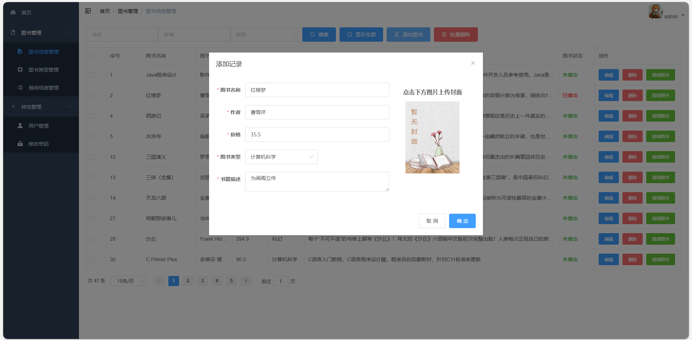
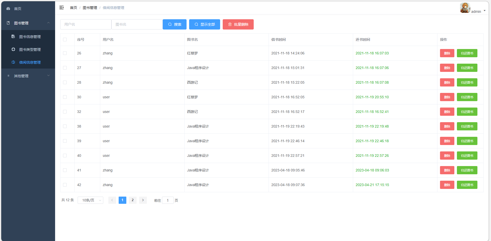
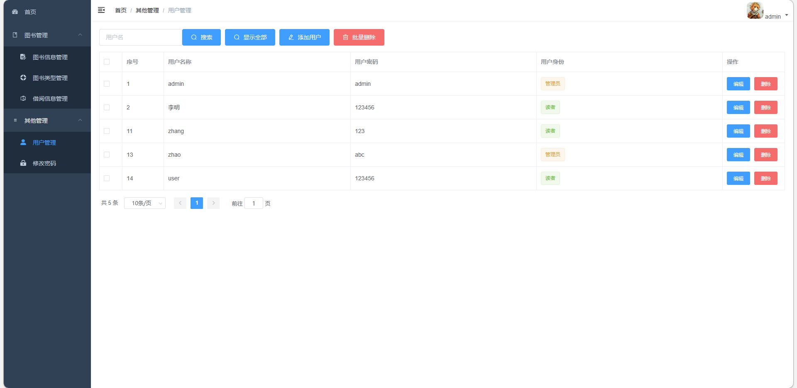
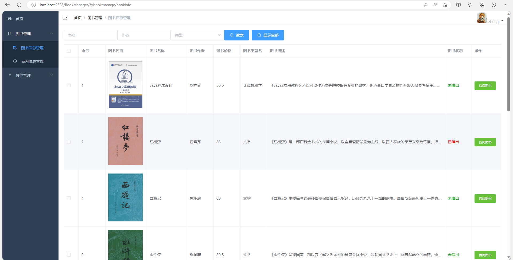
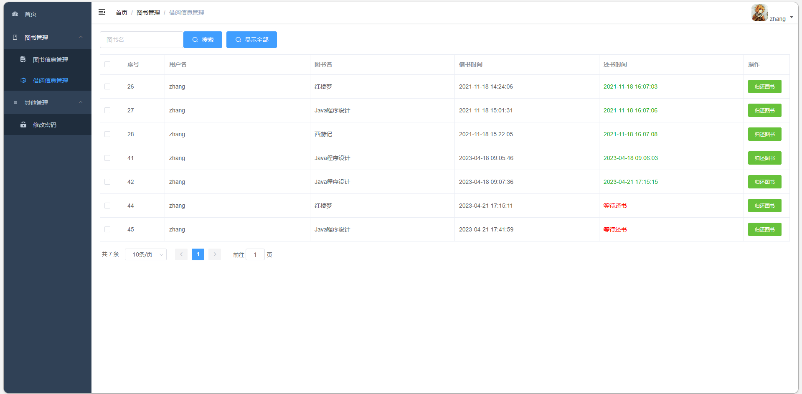
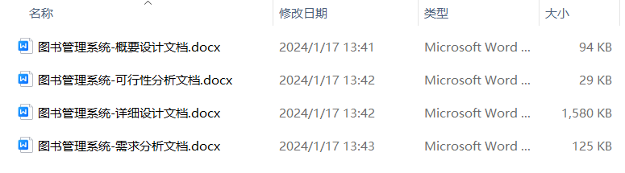
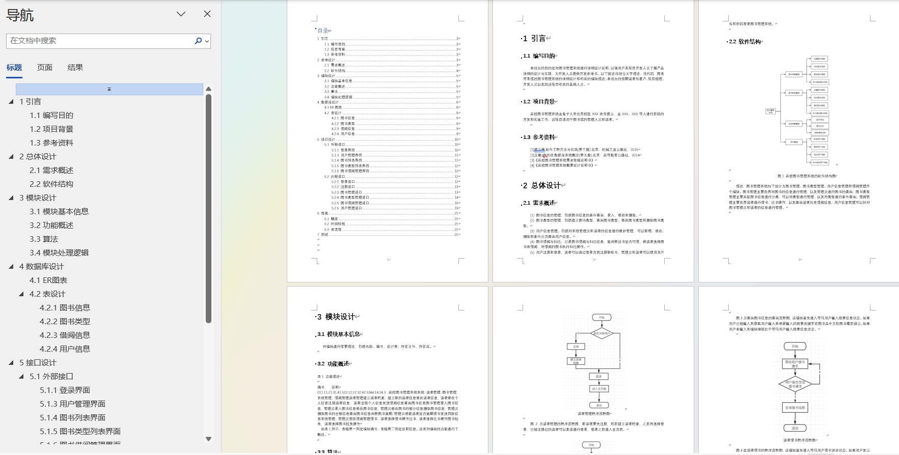

# 图书借阅管理系统带万字文档

## 一、项目介绍

基于Springboot+vue的前后端分离图书借阅管理系统

开发语言：java

运行环境:idea或eclipse vscode 数据库:mysql

技术：JAVA、 SpringBoot、MyBatis、MySQL、 Vue

【功能介绍】

本图书借阅管理系统的功能，主要是后端管理系统，角色就分为普通用户和管理员两大角色，

主要功能包括：图书信息管理、图书类别管理、借阅信息管理、用户管理、修改密码、用户借书、用户还书。

### 完整项目获取

通过网盘分享的文件：图书管理系统

链接: https://pan.baidu.com/s/1Q6reBkPWP1dn9fPSx8fwyw?pwd=tpfv 提取码: tpfv
--来自百度网盘超级会员v3的分享

通过网盘分享的文件：工具包

链接: https://pan.baidu.com/s/1YmdoJvkjoUjA75wvHLDZ6A?pwd=xm96 提取码: xm96
--来自百度网盘超级会员v3的分享

需要远程项目部署或项目修改和毕业设计也可联系（添加申请时请备注好来意）

通过网盘分享的文件：远程调试部署联系方式

链接: https://pan.baidu.com/s/1W0dDcoZmayG0c7USJDYBYg?pwd=nqd7 提取码: nqd7
--来自百度网盘超级会员v3的分享

## 二、部分功能界面展示

## 三、万字文档参考

